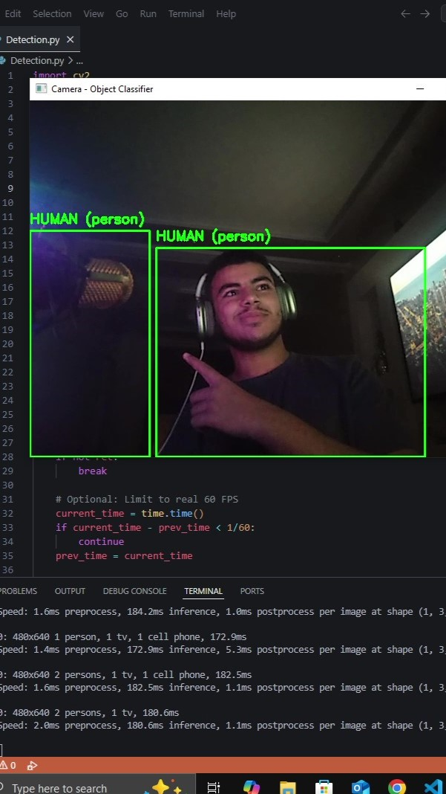

# 🧠 Real-Time Object & Animal Detection with YOLOv8 (Low-End PC Friendly)

This project uses [YOLOv8](https://github.com/ultralytics/ultralytics) + OpenCV to detect real-world objects like Rubik's cubes, cameras, and animals — **in real time**, even on **old PCs** with no GPU! 🖥️💨

### 📸 Features
- Real-time detection with webcam
- Detects only selected objects (camera, phone, glasses, etc.)
- Animal detection included (cat, dog, bird...)
- Lightweight setup for low-end hardware
- Clean Python code — beginner friendly

---

### 🚀 Demo
> Your webcam detects only what you want:
- ✅ Objects: `camera`, `glasses`, `cell phone`, `laptop`, etc.
- ✅ Animals: `dog`, `cat`, `horse`, etc.
- ❌ Ignores humans, cars, random stuff



---

### 🔧 Requirements
- Python 3.8+
- OpenCV
- Ultralytics

```bash
pip install opencv-python ultralytics
